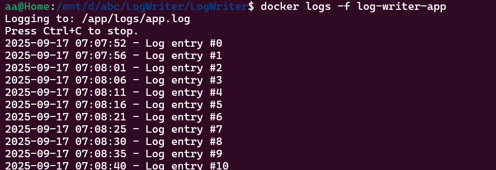

# AZ-204-Docker-Logwriter

To build the Docker image for this project

Go to the  \LogWriter folder where .csproj and Docker file are located.

at command prompt , Write following commnd  

docker build -t log-writer . 

to buid the docker image 

Run the docker container with below command

docker run -d --name log-writer-app   -v $(pwd)/logs:/app/logs   log-writer

This will create the docker container and map the container log folder to  external folder at host (/app/logs)

## How to see Running logs in container

Run this command and see runing logs from container
 
 docker logs -f log-writer-app

